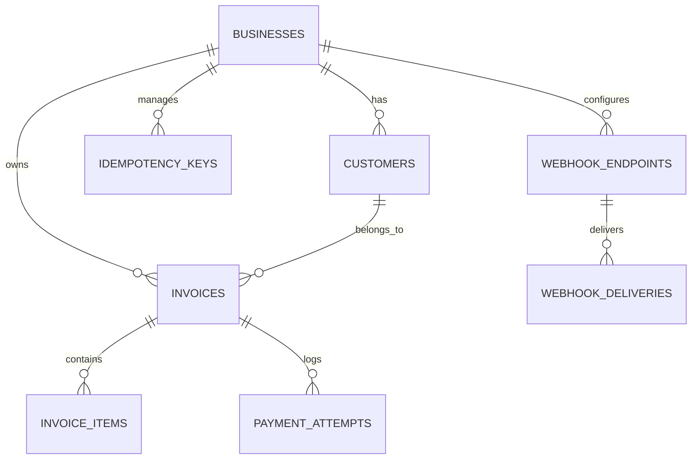
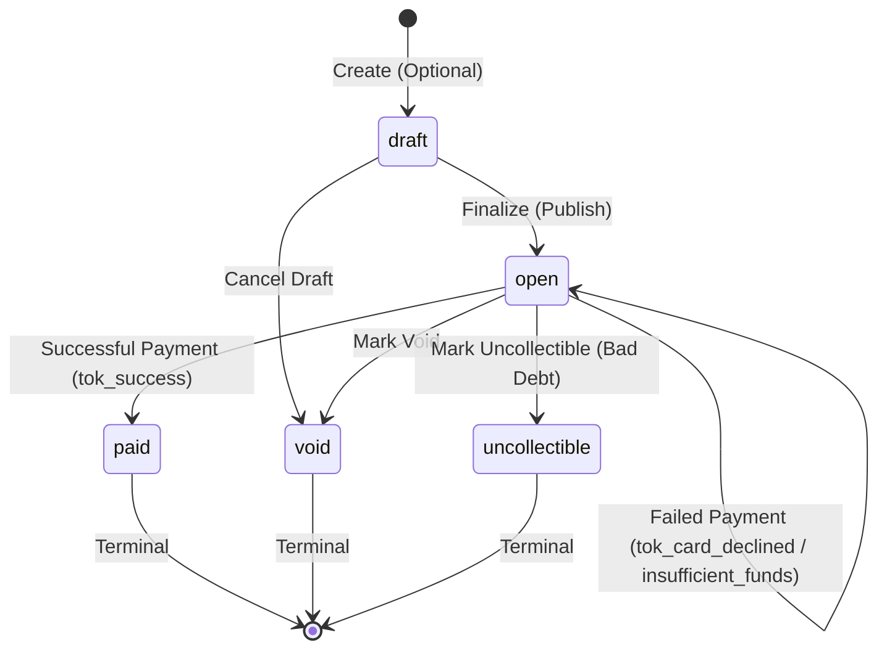

# System Design Document: Invoice & Payment Service

This document describes the architectural, data, and protocol design of the Dodo Payments Invoice & Payment Service.

---

## 1. Data Model

We use PostgreSQL as our database engine. The schemas are structured around strong foreign keys, index-backed lookup fields, and transactional integrity.



### Table Listings

#### 1. `businesses`
Stores registered businesses that use the billing platform.
- **`id`**: UUID, Primary Key. Generates automatically.
- **`name`**: VARCHAR(255).
- **`api_key_hash`**: VARCHAR(64) UNIQUE, Indexed. Store SHA-256 hash of the API key to ensure plaintext credentials are never compromised in a DB leak.

#### 2. `customers`
Customers belonging to businesses.
- **`id`**: UUID, Primary Key.
- **`business_id`**: UUID, Foreign Key.
- **`name`**: VARCHAR(255).
- **`email`**: VARCHAR(255).
- **Constraints**: UNIQUE (`business_id`, `email`) prevents duplicate emails for the same business.

#### 3. `invoices`
Invoices billed to customers.
- **`id`**: UUID, Primary Key.
- **`business_id`**: UUID, Foreign Key.
- **`customer_id`**: UUID, Foreign Key.
- **`status`**: VARCHAR(50). CHECK constraint forces `draft`, `open`, `paid`, `void`, or `uncollectible`.
- **`amount_cents`**: BIGINT. Represents money in minor units (cents) to avoid floating-point issues.
- **`due_date`**: TIMESTAMPTZ.
- **Indexes**: `idx_invoices_business_id_status` for fast list lookups.

#### 4. `invoice_items`
Individual line items inside an invoice.
- **`id`**: UUID, Primary Key.
- **`invoice_id`**: UUID, Foreign Key (CASCADE ON DELETE).
- **`description`**: VARCHAR(255).
- **`quantity`**: INT. Must be > 0.
- **`unit_amount_cents`**: BIGINT. Must be >= 0.

#### 5. `payment_attempts`
Logs every transaction attempt sent to the payment processor.
- **`id`**: UUID, Primary Key.
- **`invoice_id`**: UUID, Foreign Key (RESTRICT ON DELETE).
- **`status`**: VARCHAR(50). CHECK forces `pending`, `succeeded`, or `failed`.
- **`card_token`**: VARCHAR(255).
- **`psp_reference`**: VARCHAR(255) UNIQUE.
- **`error_code`**: VARCHAR(100).
- **`idempotency_key`**: VARCHAR(255). Links the attempt back to the client's `Idempotency-Key` for crash recovery mapping.

#### 6. `idempotency_keys`
Caches final response status and payload to guarantee API idempotency.
- **`idempotency_key`**: VARCHAR(255).
- **`business_id`**: UUID, Foreign Key.
- **`request_path`**: VARCHAR(255).
- **`response_status`**: SMALLINT.
- **`response_body`**: TEXT.
- **Primary Key**: (`business_id`, `idempotency_key`).

#### 7. `webhook_endpoints`
Stores URLs registered by businesses to receive webhooks.
- **`id`**: UUID, Primary Key.
- **`business_id`**: UUID, Foreign Key.
- **`url`**: VARCHAR(1024).
- **`secret`**: VARCHAR(255). The signing secret for payload HMAC-SHA256 calculations.

#### 8. `webhook_deliveries` (Transactional Outbox)
Queues webhook events safely using the Outbox pattern.
- **`id`**: UUID, Primary Key.
- **`business_id`**: UUID, Foreign Key.
- **`endpoint_id`**: UUID, Foreign Key.
- **`event_type`**: VARCHAR(100).
- **`payload`**: JSONB.
- **`status`**: VARCHAR(50). CHECK forces `pending`, `succeeded`, or `failed`.
- **`attempts`**: INT. Defaults to 0. Max 5.
- **`next_attempt_at`**: TIMESTAMPTZ.
- **Indexes**: `idx_webhook_deliveries_status_next_attempt` for polling performance.

### Scale-out Strategy (At 100x Scale)
1. **Database Partitioning**: `payment_attempts` and `webhook_deliveries` write heavily and grow infinitely. We would partition these tables horizontally by `created_at` (range partitioning) or `business_id` (hash partitioning).
2. **Idempotency Key TTL**: We would use an auto-cleanup process or move `idempotency_keys` to a distributed key-value store (like Redis) with a TTL of 7 days, freeing up the primary relational database.
3. **Read Replicas**: Separate reads (GET `/invoices`, GET `/customers`) from transactional writes using replication.

---

## 2. Invoice State Machine

The invoice transitions between states based on finality or billing updates.



### Transition Validation and Reversibility
- **Valid Transitions**:
  - `draft` -> `open` | `void`
  - `open` -> `paid` | `void` | `uncollectible`
- **Reversibility**: Transitions to `paid`, `void`, and `uncollectible` are strictly **non-reversible** (terminal states). A voided or paid invoice can never be paid again or modified.
- **Validation**: Attempting an invalid transition (e.g. voiding a `paid` invoice) is rejected at the API level with `422 Unprocessable Entity`. At the database layer, updates are conditional:
  `UPDATE invoices SET status = $1 WHERE id = $2 AND status = 'open'`
  to prevent concurrency state corruption.

---

## 3. Payment Correctness & Failure Modes

Handling payments correctly requires absolute prevention of double-charging and race conditions. We implement a **Three-Phase Payment Flow** combined with **Row-Level Locks (`SELECT FOR UPDATE`)** inside the database:

### Payment Flow Phases
1. **Phase 1: DB Reservation (Short-lived DB Transaction)**
   - Start transaction.
   - Run `SELECT status FROM invoices WHERE id = $1 FOR UPDATE` to lock the row.
   - Check if an active `pending` payment attempt exists (created within the last 5 minutes). If one exists with a *different* idempotency key, abort (return `409 Conflict`).
   - If one exists with the *same* idempotency key, we recognize it as a client retry (proceed to Phase 2, reusing the same `payment_attempt_id`).
   - Otherwise, insert a new `payment_attempts` record with status `pending` and commit. This releases the row lock immediately!
2. **Phase 2: External PSP Call (Outside DB Transaction)**
   - Post to Mock PSP over HTTP. We pass `payment_attempt_id` as the PSP's reference (serving as their idempotency key).
   - The HTTP client timeout is configured strictly to **5 seconds**.
3. **Phase 3: DB Resolution (Short-lived DB Transaction)**
   - Start transaction.
   - Lock invoice row again: `SELECT status FROM invoices WHERE id = $1 FOR UPDATE`.
   - Update `payment_attempts` status to `succeeded` or `failed`.
   - Update `invoices` status to `paid` (if successful) or keep `open` (if failed).
   - Write response to `idempotency_keys` table and commit.

---

### Failure Scenario Walkthrough

#### (a) Concurrent / Duplicate Payments
If two clients trigger `/pay` for the same invoice at the same millisecond:
- Transaction A obtains the row lock on `invoices` via `FOR UPDATE`. Transaction B blocks.
- Transaction A checks status (finds `open`), checks pending attempts (finds none), inserts a `pending` payment attempt, and commits. The lock is released.
- Transaction B resumes, locks the row, and checks pending attempts. It finds Transaction A's active `pending` attempt. Transaction B immediately aborts and returns `409 Conflict` without contacting the PSP.

#### (b) PSP Timeouts (tok_timeout, 30s)
- The invoice service's HTTP call to the PSP times out at 5 seconds.
- The handler catches the timeout, bypasses writing to `idempotency_keys` (since final status is unknown), and returns `202 Accepted` with a `pending` status.
- The payment attempt remains `pending` and the invoice remains `open`.
- **How caller finds out**: The caller can poll `GET /invoices/{id}` or wait for a webhook (`invoice.paid` or `invoice.payment_failed`) when it eventually resolves.
- *Production Note*: In production, a background cron/reconciliation worker would poll the PSP using the `payment_attempt_id` to fetch the eventual result, then call Phase 3 to resolve it.

#### (c) Service Crashes after PSP success but before DB persist
- The payment attempt remains `pending` in the DB.
- The client retries using the **same** `Idempotency-Key`:
  - The service checks the DB and finds the active `pending` attempt matching the same idempotency key.
  - Instead of returning conflict, the service safely retries the HTTP call to the PSP using the **same** `payment_attempt_id`.
  - The PSP (Stripe/Adyen/Mock) checks its database. Seeing the same transaction ID, it returns the *already captured* payment success rather than creating a new charge.
  - The service receives the success, runs Phase 3, updates the invoice to `paid`, and writes the response to `idempotency_keys`. **No double charge occurs.**

#### (d) Idempotency Key Reused with Different Body
- The service checks the `idempotency_keys` cache or the active `pending` payment attempt.
- If it detects that the request path or the payload (`card_token`) does not match the original attempt, it rejects the call with `400 Bad Request` to prevent request hijacking.

#### (e) Paid Invoice Receives `/pay`
- Phase 1 locks the row and checks the invoice status.
- Seeing the status is `paid` (a terminal state), it immediately rollbacks the transaction and rejects the request with `422 Unprocessable Entity`.

---

### Why Row-Level Locking (`SELECT FOR UPDATE`)?
- **Optimistic Concurrency Control (OCC)** (using a version column) is excellent for low-contention environments but requires clients to retry their requests if they fail the version check.
- **Advisory Locks** are clean but require manual key management and are decoupled from the table data schema.
- **Pessimistic Row-Level Locking (`FOR UPDATE`)** is ideal here because it enforces strict serialization on the database level for the duration of the critical check-and-insert step, protecting state invariants reliably without holding locks during slow external HTTP calls.

---

## 4. Webhook Design

### Decoupled outbox via Transactional Outbox Pattern
To ensure we never block API request paths and never lose events on crashes, webhooks are implemented via the **Transactional Outbox Pattern**:
- Webhook events (`invoice.created`, `invoice.paid`, etc.) are inserted into the `webhook_deliveries` table within the **same database transaction** that updates the invoice status.
- A background worker thread polls the `webhook_deliveries` table every second for `pending` or retriable `failed` entries, executing delivery asynchronously.

```
[API Route] ---> (Update Invoice & Insert Outbox Event) ---> [DB Commit]
                                                                  |
                                                                  v
[Background Worker] <--- (Poll Pending Events) <------------------+
        |
        +---> (HMAC-SHA256 Sign Body) ---> [HTTP POST to Client Url]
```

### Signing and Replay Protection
- We compute an **HMAC-SHA256 signature** of the webhook payload using the endpoint's `secret`.
- We add the header `X-Dodo-Signature: t=<timestamp>,v1=<signature>`.
- The signature is calculated over `t=<timestamp>.<json_payload>`. This binds the timestamp to the payload. Receivers should verify the signature and ensure that the timestamp is within 5 minutes of their system time to prevent replay attacks.

### Retry Policy
- On failure (non-2xx response or network error), the worker increments the attempt counter and schedules a retry with exponential backoff:
  - **Attempt 1**: +15 seconds
  - **Attempt 2**: +1 minute
  - **Attempt 3**: +5 minutes
  - **Attempt 4**: +30 minutes
  - **Attempt 5**: +2 hours
- After 5 attempts, the delivery status is marked as `failed` (exhausted) and no more attempts are made.
- **Reconciliation**: Businesses can query the `GET /invoices` endpoint or webhook delivery logs to manually reconcile any missed events.

---

## 5. API Key Model

### Key Format
- We generate keys with a secure random value: `dodo_sk_live_<64_hex_chars>`.

### Storage and Transmission
- We store only the **SHA-256 hash** of the API key in the database (`api_key_hash`). This ensures that even if the database is leaked, an attacker cannot recover the plaintext keys to make authenticated calls.
- Clients transmit keys in the `Authorization: Bearer <api_key>` header.

### Rotation, Revocation, and Blast Radius
- **Revocation**: Simple removal of the business row or key hash from the database.
- **Rotation**: A business creates a secondary key hash, verifies functionality, and removes the old key hash.
- **Blast Radius**: API keys are scoped strictly to a single business ID. If a key is leaked, only the data for that specific business is compromised; other businesses are unaffected.

---

## 6. What We Cut and Why

1. **Reconciliation Cron/Worker**: We cut the background scheduler that polls the PSP for timed-out transactions. For a 4-6 hour take-home budget, we chose to model the correct `pending` state and document recovery, rather than building additional background cron polling infrastructure.
2. **Multi-Currency / FX**: Handled only USD minor units (cents) to focus on the correctness of core state transitions and failure modes.
3. **Partial Payments / Refunds**: Left out as explicitly out of scope, allowing us to model invoice status transitions deterministically (e.g. `paid` is a final terminal state).
4. **Endpoint Rate Limiting**: Standard API rate limiting was omitted to keep the Docker configurations simple and direct, avoiding the need for an API gateway or Redis deployment.

---

## 7. Production Readiness Gap

If this system were to be shipped to production tomorrow, the top 3 missing components would be:
1. **PSP Webhook Handlers**: The system should handle webhooks *from the PSP* to resolve payment states. When a payment attempt times out or is pending, the PSP will send an asynchronous webhook notifying us of the final success or failure. We should expose a public endpoint `/webhooks/psp` to process these notifications.
2. **Observability and Tracing**: We need distributed tracing (e.g. OpenTelemetry with Jaeger) and structured JSON logging. If a payment hangs or a webhook fails, we need to trace the transaction ID across the API, database, and outgoing HTTP requests.
3. **Database Migration and Lock Audits**: Under high concurrent load, multiple `FOR UPDATE` queries could lead to database deadlock or connection pool exhaustion. We would need to set strict database statement timeouts (`SET statement_timeout = 3000`) and implement connection pool monitoring.
